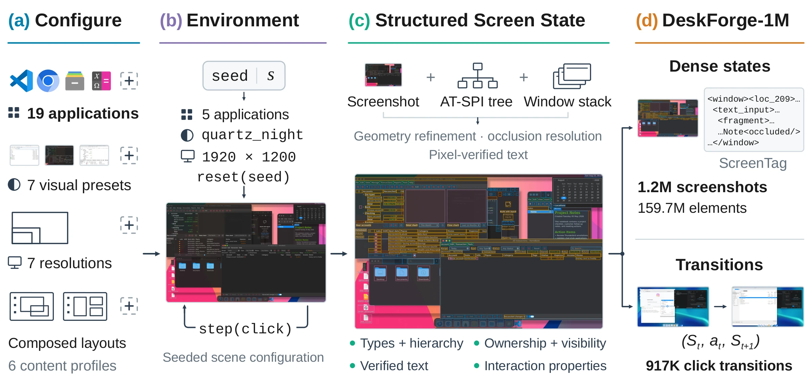

<div align="center">

# DeskForge

### Dense Supervision from Desktop Environments for Computer-Use Agents

[A. Said Gurbuz](https://saidgurbuz.github.io/)<sup>1,2</sup> ·
[Ahmed Nassar](https://research.ibm.com/people/ahmed-nassar)<sup>2</sup> ·
[Sunghwan Hong](https://sunghwanhong.github.io/)<sup>1</sup> ·
[Marc Pollefeys](https://cvg.ethz.ch/team/Prof-Dr-Marc-Pollefeys)<sup>1,3</sup> ·
[Peter W. J. Staar](https://research.ibm.com/people/peter-staar)<sup>2</sup>

<sup>1</sup>ETH Zurich · <sup>2</sup>IBM Research Zurich · <sup>3</sup>Microsoft

[**Project page**](https://saidgurbuz.github.io/deskforge/) · [**Paper**](https://arxiv.org/abs/2610.02320) · [**DeskForge-1M**](https://huggingface.co/datasets/docling-project/DeskForge-1M) · [**Model**](https://huggingface.co/docling-project/DeskForge-Qwen3.5-4B)



</div>

DeskForge **generates desktops instead of recording them.** It composes real
Linux applications into controlled multi-window scenes, varies their state,
content, layout, appearance and resolution, and fuses screenshots,
accessibility trees and window geometry into dense annotations of *every
visible element*. Each executed click is recorded with the screen before and
after it.

This repository contains the environment and the full generation pipeline used
to build **DeskForge-1M**: 1.21M annotated desktop observations, 159.7M element
instances and 917K recorded click transitions.

<table>
<tr>
<td width="33%"><b>Controllable scenes</b><br>Applications, initial states, staged content, window layout and stacking, appearance presets and display resolution are all set by a seeded scene specification.</td>
<td width="33%"><b>Dense, occlusion-aware labels</b><br>Every visible element with type, text, geometry, hierarchy and window ownership; partly covered controls keep only their exposed region.</td>
<td width="33%"><b>Recorded interactions</b><br>Clicks inside visible regions, each stored as a (S<sub>t</sub>, a<sub>t</sub>, S<sub>t+1</sub>) transition with what changed.</td>
</tr>
</table>

## Demo


https://github.com/user-attachments/assets/2f4c5406-7ca3-48d3-8215-5df6f703c540


*The same planner drives InternVL3.5-8B before (left) and after (right)
fine-tuning on DeskForge-1M, on a WebArena-Infinity GitLab task. The full demo
is on the [project page](https://saidgurbuz.github.io/deskforge/).*

## Contents

- [Installation](#installation)
- [Quick start](#quick-start)
- [What a capture contains](#what-a-capture-contains)
- [Configuring scenes](#configuring-scenes)
- [Generating at scale](#generating-at-scale)
- [Quality checks and inspection](#quality-checks-and-inspection)
- [Repository layout](#repository-layout)
- [Citation](#citation)

## Installation

**Requirements.** An x86_64 Linux machine with `dnf` (developed and run on
RHEL 9) and the system Python 3 (≥ 3.9) with PyGObject, which capture needs to
talk to the accessibility bus. No root access, desktop session or physical
display is needed: every scene runs in its own headless Xvfb session.

```bash
git clone https://github.com/Saidgurbuz/deskforge.git
cd deskforge

# Python dependencies for the system interpreter (PyGObject is python3-gobject).
python3 -m pip install --user pyyaml pillow numpy tqdm

# Download and extract Xvfb, D-Bus, xdotool, Xfce and the desktop applications
# into ./tools (userland only, nothing is installed system-wide), then the
# theme, icon and dock packs used by the appearance presets.
bash scripts/setup_tools.sh
export PYTHONPATH=$PWD/src
alias deskforge="python3 -m deskshot.cli"
deskforge install-styles

# Check that a headless session starts and the accessibility bus answers,
# then that every application launches on this machine.
deskforge validate
deskforge preflight
```

The package's working name is `deskshot`. With pip ≥ 21.3, `pip install -e .`
installs the same CLI as `deskforge` (and `dsd`).

## Quick start

**1. Compose a scene without running it.** A seed fully determines the scene:
applications, their states and content, layout, appearance and resolution.

```bash
deskforge scene --seed 820000 --describe-only
```

**2. Capture it.** One headless desktop is started, the applications are
launched and arranged, and the screen is annotated.

```bash
deskforge scene --seed 820000 --include-chrome --output runs/first_scene
```

**3. Record an interaction episode.** After the first observation, DeskForge
clicks sampled actionable elements inside their visible regions and captures the
screen after every step.

```bash
deskforge scene-episode --seed 820001 --steps 5 --output runs/first_episode
```

**4. Look at the result.** Render boxes over a capture, or browse a whole run in
the local inspector (boxes, per-sample statistics and audit flags).

```bash
python3 scripts/render_annotations.py runs/first_scene --out runs/first_scene_viz
python3 scripts/inspect_annotations.py        # http://localhost:8000
```

## What a capture contains

Every observation is written as a set of files sharing one stem:

| File | Content |
| --- | --- |
| `<stem>.png` | the screenshot |
| `<stem>.elements.leaf.json` | the visible, redundancy-reduced element view used for parsing and training |
| `<stem>.elements.json` | all retained elements, including structural nodes |
| `<stem>.elements.amodal.json` | full element extents, as if nothing covered them |
| `<stem>.elements.unfiltered.json` | the full reconciled tree, before occlusion clipping and deduplication |
| `<stem>.screentag.txt` | the screen serialized as [ScreenTag](https://github.com/Saidgurbuz/screenparse) markup (0–500 location grid) |
| `<stem>.meta.json` | scene specification, applications, window stack, theme and resolution |
| `<stem>.verdict.json` | automated quality verdicts for this capture |
| `episode.json` | for episodes: the executed actions, their targets and what changed |

Element records carry the element's type, text, geometry (full extent and the
visible fragments left by overlapping windows), interaction properties,
parent–child structure, reading order, and owning application and window.

## Configuring scenes

| What | Where |
| --- | --- |
| Applications | `configs/apps/*.yaml` — one manifest per application: launch command, staged documents, scripted interactions. DeskForge-1M uses 19 of them. |
| Staged content | `assets/audit/` — the documents, projects, archives and data the applications open |
| Appearance presets | `src/deskshot/environment/themes.py` — `linux_classic`, `ubuntu_like`, `windows_redmond`, `macos_tahoe_like`, `macos_tahoe_glass`, `quartz_night`, `quartz_night_nord` (`deskforge themes` lists them) |
| Resolutions and scene sampling | `src/deskshot/generation/scene_composer.py` — sampling weights for applications, window counts, layouts, presets and the seven resolutions (1366×768 to 3840×2160) |
| Pipeline defaults | `configs/pipeline.yaml` |

An application is added with a manifest, provided its accessibility tree
exposes the main interface content. All presets run on the same Linux backend:
they reproduce the visual conventions of other desktops (widgets, icons, window
decorations, panels and docks) rather than executing native Windows or macOS
applications.

## Generating at scale

`scene-batch` runs many scenes with persistent workers, each owning its own X
display; the pixel audit runs on every capture.

```bash
# Freeze a plan of scenes, then run it (sharded and resumable).
deskforge scene-plan  --start-seed 900000 --count 1000 --output runs/plan.jsonl
deskforge scene-batch --plan runs/plan.jsonl --output runs/batch \
    --parallel-workers 4 --scene-timeout 1200 --include-chrome
```

Use `scripts/lease_display.py` to reserve free display numbers when several runs
share a machine, and `scripts/cleanup_stale_sessions.py --apply` to reclaim
sessions left by interrupted runs. `scripts/submit_generation.sh`,
`scripts/supervise_generation.py` and `scripts/watch_generation.py` submit,
supervise and monitor sharded generation on an LSF cluster, the setup used for
DeskForge-1M. `scripts/build_release_manifests.py`, `scripts/build_eval_splits.py`
and `scripts/pack_hf_release.py` turn a finished corpus into the released
WebDataset shards, Parquet indexes and scene-level evaluation splits
(`release_assets/` holds the dataset card and loading examples).

## Quality checks and inspection

```bash
python3 scripts/qa.py audit   --root runs/batch    # quality.json
python3 scripts/qa.py compare --before <run> --after runs/batch
python3 scripts/qa.py gate    --root runs/batch    # pass/fail against the baseline
```

Three pixel-level audits target both failure directions: text drawn over
nothing (`audit_annotation_pixels.py`), visible ink without an element
(`audit_element_coverage.py`) and boxes with nothing behind them
(`audit_blank_widgets.py`). `scripts/show_flagged.py` shows what a metric
flagged before acting on it, and `scripts/check_scene_determinism.py` confirms
that a seed reproduces its scene.

The unit tests need no display; the few that start a desktop or a browser are
skipped until `scripts/setup_tools.sh` has run.

```bash
python3 -m pip install --user pytest pymupdf pyarrow
python3 -m pytest tests -q
```

## Repository layout

```
src/deskshot/
  generation/      scene composition, layouts, sampling, episode and task logic
  environment/     Xvfb/D-Bus/Xfce sessions, themes, panels, docks, wallpapers, fixtures
  automation/      application launching and input (xdotool)
  extraction/      AT-SPI walking, occlusion and visibility, text checks, ScreenTag
  pipeline/        batch orchestration and persistent workers
  postprocessing/  filtering and quality scoring
  release/         release schema, keys, splits and transitions
  inspector/       local web inspector and annotation audit
configs/           application manifests and pipeline defaults
assets/            staged documents, wallpapers and the browser site list
scripts/           setup, generation, audits, release packing, website tools
tests/             unit tests
docs/              project page (GitHub Pages)
```

## Citation

```bibtex
@misc{gurbuz2026deskforge,
      title={DeskForge: Dense Supervision from Desktop Environments for Computer-Use Agents},
      author={A. Said Gurbuz and Ahmed Nassar and Sunghwan Hong and Marc Pollefeys and Peter W. J. Staar},
      year={2026},
      eprint={2610.02320},
      archivePrefix={arXiv},
      primaryClass={cs.CV},
      url={https://arxiv.org/abs/2610.02320},
}
```

## Acknowledgements

The annotation vocabulary and the ScreenTag serialization build on
[ScreenParse](https://github.com/Saidgurbuz/screenparse). DeskForge is developed at
ETH Zurich and at IBM Research Zurich by members of the
[Docling](https://github.com/docling-project/docling) team.
